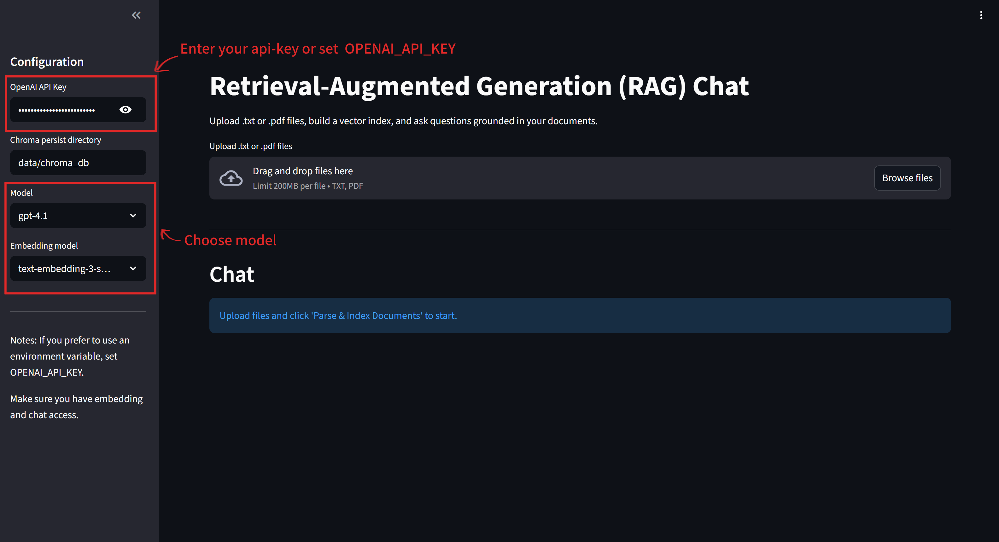
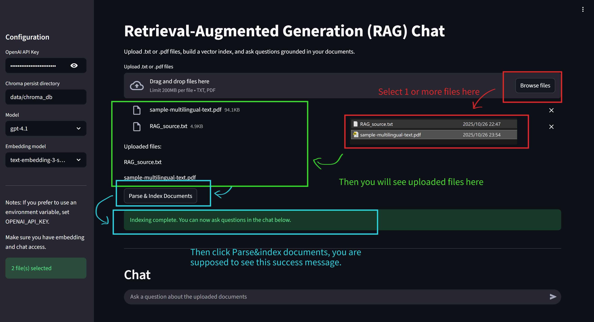
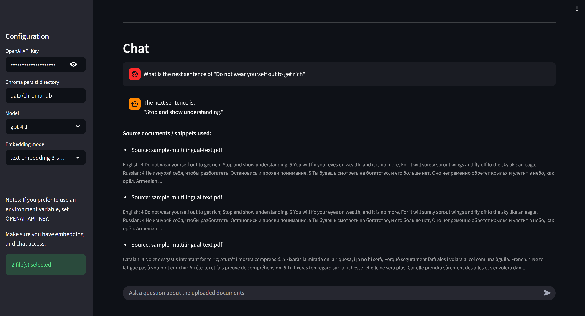

# RAG Chat - INFO-5940 Assignment

This repository contains a Retrieval-Augmented Generation (RAG) demo built with Streamlit, LangChain, and ChromaDB. The app lets you upload .txt and .pdf documents, automatically chunk them, build a persistent Chroma vector index using OpenAI embeddings, and interact with the documents via a conversational chat UI.

## Features

- Upload multiple documents (.txt and .pdf supported)
- Automatic text extraction (PDF via pypdf) and chunking (RecursiveCharacterTextSplitter)
- Build and persist a Chroma vector store (default: `data/chroma_db`)
- Choose embedding model (defaults to `openai.text-embedding-3-small`; `openai.text-embedding-3-large` available with automatic fallback)
- Conversational retrieval using LangChain's `ConversationalRetrievalChain` (answers grounded in retrieved chunks)
- Source snippets shown for transparency when available
- Small helper scripts to inspect available models (`scripts/check_models.py`) and save the results (`scripts/models_available.json`)

## Files of interest

- `main.py` - Streamlit application (entry point)
- `rag_utils.py` - Utilities: file parsing, chunking, creating Chroma vectorstore, and wiring the conversational chain
- `requirements.txt` - Python dependencies (note: `chromadb` was added)
- `scripts/check_models.py` - Lists models available to the configured OpenAI API key and writes JSON output
- `scripts/models_available.json` - Example output from `check_models.py` (generated during development)
- `data/` - data folder used for storing persistent Chroma DB (`data/chroma_db`) and sample source files

## Run instructions (Codespace / devcontainer)

1. Install dependencies (inside the provided virtual environment / devcontainer):

```bash
pip install -r requirements.txt
```

2. Provide your OpenAI API key. Either set an environment variable or paste it into the Streamlit sidebar at runtime:

```bash
export OPENAI_API_KEY="sk-..."
```

3. Start the Streamlit app:

```bash
streamlit run main.py
```

4. In the app UI (sidebar):
- Enter your API key (if not set as env var).
- Select an embedding model (default is `openai.text-embedding-3-small`). The app will attempt the selected model and automatically fall back to `openai.text-embedding-3-small` if the chosen model is not available for your key.

5. Upload one or more `.txt` or `.pdf` files, click **Parse & Index Documents** and wait for indexing to finish. 


6. Then ask questions in the chat box. Here is a sample chat record.


## Configuration changes made

- `requirements.txt` was updated to include `chromadb` (to support a persistent Chroma vector DB). 
- Added helper scripts under `scripts/`:
	- `check_models.py` — check models available to the API key and categorizes them.
	- `models_available.json` — example output of model detection saved during development.

## Implementation notes

- Chunking: `RecursiveCharacterTextSplitter(chunk_size=1000, chunk_overlap=200)` — chosen to balance retrieval granularity and context size for LLM prompts.
- Embeddings: uses OpenAI embeddings via LangChain. The app defaults to `openai.text-embedding-3-small` and allows selecting `openai.text-embedding-3-large`; the code handles fallback when a model is not available.
- Conversation memory: to avoid ambiguity with chain outputs, the chain is created without attaching LangChain memory; chat history is managed explicitly in Streamlit `st.session_state` and passed to the chain on each call.

## Troubleshooting

- If you see 400 errors during embedding, choose `openai.text-embedding-3-small` or confirm your key has access to the larger embedding model. Use `scripts/check_models.py` to list available models for your API key.
- To clear the persisted Chroma DB, stop the app and delete the directory `data/chroma_db`.

## Next steps / improvements

- Add unit tests for chunking and PDF parsing.
- Expose chunk size and overlap settings in the UI.
- Provide controls to clear or rebuild the index from the UI.
- Migrate LangChain imports to `langchain-community` / `langchain_openai` to address deprecation warnings.

